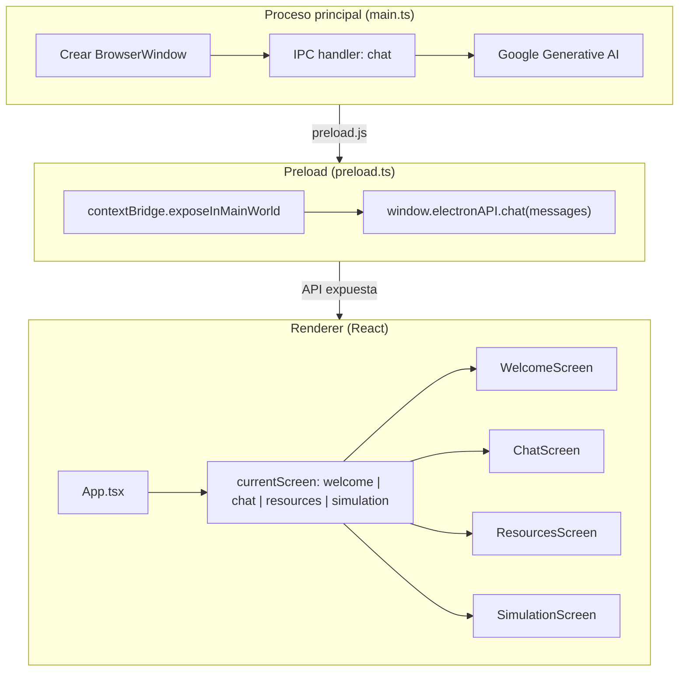
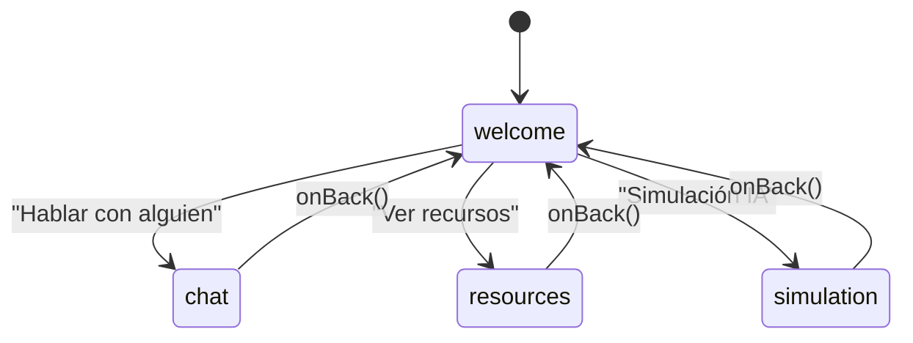
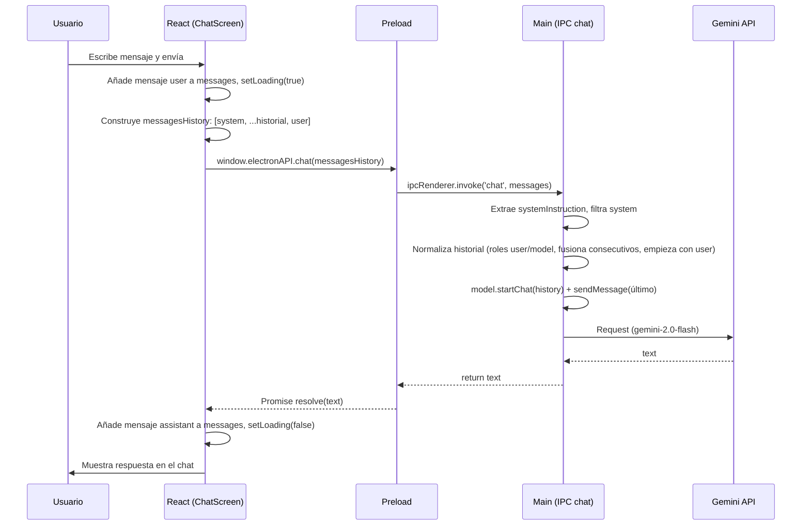

# Diagrama de funcionamiento — Tu Amigo (tuamigo-desktop)

App de escritorio **Electron + React (Vite)** para apoyo emocional ante acoso escolar. Este documento describe la arquitectura y los flujos principales del código.

> **Para una versión orientada a público no técnico** (diagramas con lenguaje sencillo, análisis DAFO, competencia y marco tecnológico), ver [DOCUMENTACION-GENERAL.md](DOCUMENTACION-GENERAL.md).

---

## 1. Arquitectura general

La aplicación sigue el modelo clásico de Electron: proceso principal (Node), preload (puente seguro) y renderer (React en el navegador embebido).



**Resumen:**

- **main.ts**: arranca la app, crea la ventana (1200×800), carga la URL de desarrollo o `dist/index.html`. Registra el handler IPC `chat` que usa `GEMINI_API_KEY` y el modelo `gemini-2.0-flash`.
- **preload.ts**: con `contextBridge` expone `window.electronAPI.chat(messages)` al renderer; no hay `nodeIntegration` en el renderer.
- **App.tsx**: estado `currentScreen`; según su valor se renderiza `WelcomeScreen`, `ChatScreen`, `ResourcesScreen` o `SimulationScreen`. Todas las pantallas secundarias tienen botón "atrás" que vuelve a `welcome`.

---

## 2. Flujo de navegación entre pantallas

La única pantalla de entrada es la de bienvenida. Desde ahí el usuario elige una de las tres acciones.



**Pantallas:**

| Pantalla | Descripción |
|----------|-------------|
| **WelcomeScreen** | Inicial. Tres botones: "Hablar con alguien" (→ chat), "Ver recursos" (→ resources), "Simulación IA" (→ simulation). |
| **ChatScreen** | Chat con la IA "Tu Amigo". El usuario escribe; se llama `electronAPI.chat(messagesHistory)` con system prompt de asistente empático; la respuesta de Gemini se muestra en el chat. |
| **ResourcesScreen** | Contenido estático: emergencia 112, teléfono ANAR, guías (ciberacoso, técnicas de relajación). |
| **SimulationScreen** | Dos IAs dialogan: víctima "Alex" y ayudante "Tu Amigo". Flujo en bucle: turno Víctima → análisis de perfil en segundo plano → turno Helper. Panel derecho: métricas emocionales y ficha del estudiante. Opción de guardar sesión en JSON. |

---

## 3. Flujo de un mensaje de chat (Usuario → Gemini → respuesta)

En **ChatScreen**, cada envío del usuario pasa por el preload al proceso principal y de ahí a Gemini; la respuesta vuelve por el mismo camino.



**Detalles del backend (main):**

- El handler `chat` recibe un array de mensajes `{ role, content }` (roles: `system`, `user`, `assistant`/`model`).
- Se usa el mensaje con `role === 'system'` como `systemInstruction` del modelo.
- Se filtran los mensajes que no son system; el último es el "prompt actual"; el resto es historial.
- Historial normalizado: se mapean roles a `user`/`model`, se fusionan mensajes consecutivos del mismo rol y se fuerza que el primer mensaje sea de usuario (si no, se añade un user inicial).
- Se crea el chat con `startChat({ history })` y se envía el último mensaje; se devuelve `response.text()` o un mensaje de error.

---

## 4. Flujo de la simulación (Victim → análisis → Helper → bucle)

En **SimulationScreen** el flujo es un bucle: turno de la Víctima (Alex), análisis de perfil en segundo plano, turno del Helper (Tu Amigo), y repetición.

```mermaid
flowchart LR
    subgraph Init
        A[Iniciar Simulación] --> B[runSimulationStep con history vacío]
    end

    subgraph Loop
        B --> C[Turno Víctima]
        C --> C1[IPC chat: system = Alex, emociones actuales]
        C1 --> C2[Gemini devuelve JSON: text + emotions]
        C2 --> D[Actualizar mensajes y métricas]
        D --> E[analyzeProfile en segundo plano]
        E --> E1[IPC chat: system = extraer perfil JSON]
        E1 --> E2[Actualizar ficha estudiante]
        D --> F[Esperar 1,5 s]
        F --> G[Turno Helper]
        G --> G1[IPC chat: system = Tu Amigo, máx 15 palabras]
        G1 --> G2[Mostrar typing, delay según longitud]
        G2 --> G3[Split por '|' y añadir mensajes]
        G3 --> H{simulationRef.current?}
        H -->|Sí| I[setTimeout 2s → runSimulationStep con history actualizado]
        I --> C
        H -->|No| J[Fin]
    end
```

**Pasos del bucle:**

1. **Turno Víctima**: Se llama `electronAPI.chat(victimPrompt)`. El system prompt define a "Alex" (14 años, acoso), inyecta las métricas actuales (tristeza, ansiedad, alivio, esperanza) y pide respuesta en JSON con `text` y `emotions`. Se parsea el JSON, se añade el mensaje al historial y se actualizan las métricas en el panel derecho.
2. **Análisis de perfil**: En paralelo (sin bloquear el flujo), `analyzeProfile(history)` llama a `electronAPI.chat(analysisPrompt)` con un system que pide un JSON con `name`, `age`, `situation`, `riskLevel`, `suggestedAction`. Se actualiza la ficha del estudiante cuando llega la respuesta.
3. **Turno Helper**: Tras una pausa de 1,5 s, se llama `electronAPI.chat(helperPrompt)` con system "Tu Amigo" (mensajes cortos, español, sin frases tipo robot). Se muestra indicador de escritura, se aplica un delay según longitud de la respuesta y se divide por `|` para mostrar uno o más mensajes del Helper. Cada parte se añade al historial.
4. **Siguiente iteración**: Si la simulación no se ha detenido (`simulationRef.current`), a los 2 s se llama de nuevo `runSimulationStep(currentHistory)` y se repite el ciclo.

**Guardar sesión:** El botón "Guardar" genera un JSON con `timestamp`, `profile`, `metrics` y `messages` y lo descarga como archivo.

---

## 5. Resumen de componentes y responsabilidades

| Componente | Responsabilidad |
|------------|-----------------|
| **main.ts** | Ventana, IPC `chat`, uso de Gemini (API key, modelo, normalización de historial). |
| **preload.ts** | Exponer `electronAPI.chat(messages)` de forma segura al renderer. |
| **App.tsx** | Estado `currentScreen` y renderizado condicional de las cuatro pantallas. |
| **WelcomeScreen** | Navegación a chat, resources o simulation. |
| **ChatScreen** | UI del chat, historial local, llamada a `electronAPI.chat` con system prompt de "Tu Amigo" empático. |
| **ResourcesScreen** | Contenido estático (112, ANAR, guías). |
| **SimulationScreen** | Bucle Victim → análisis → Helper; métricas emocionales; ficha de estudiante; guardar sesión en JSON. |

Todos los accesos a Gemini se hacen desde el proceso principal vía el único canal IPC `chat`, que recibe un array de mensajes y devuelve el texto de la respuesta (o un mensaje de error).
