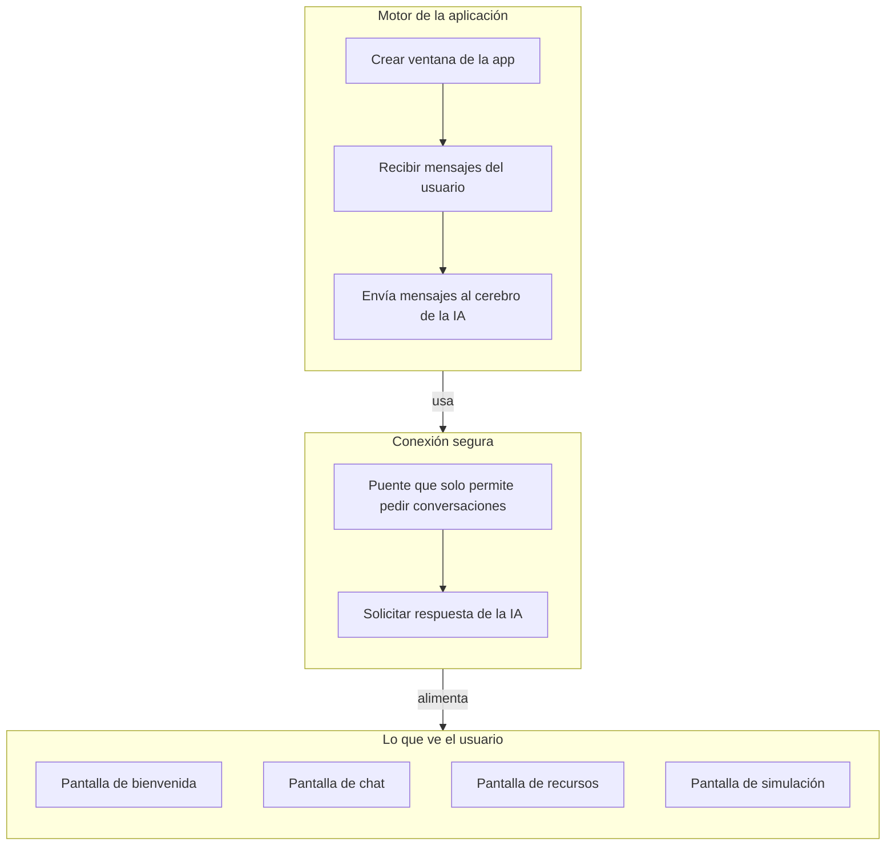
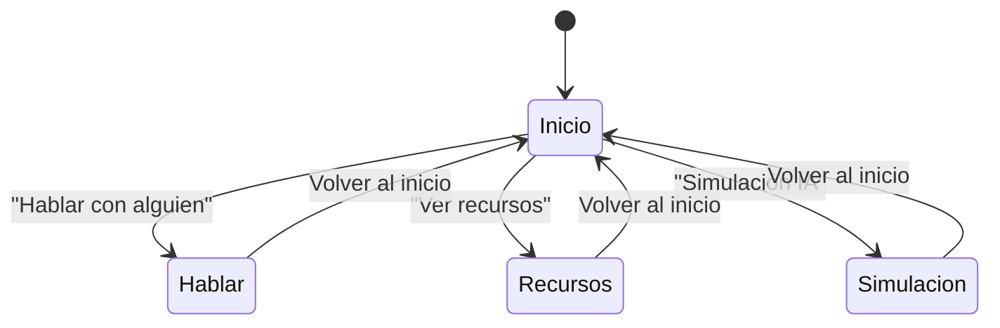
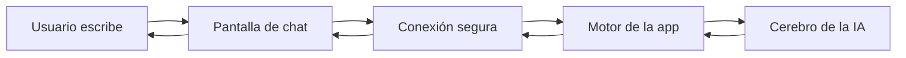
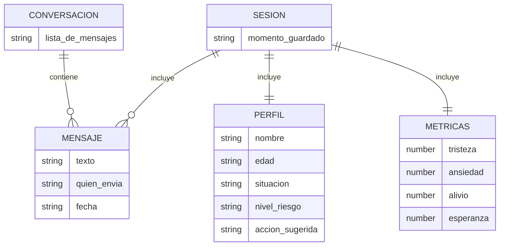
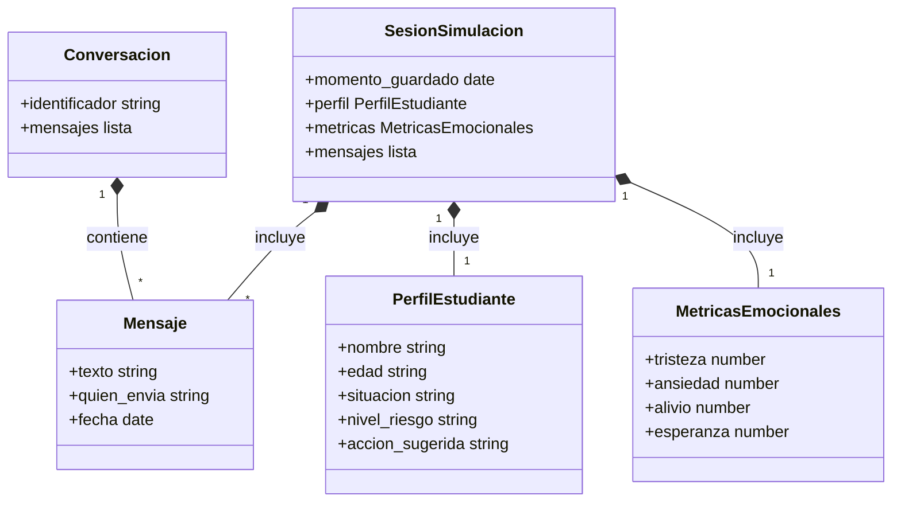
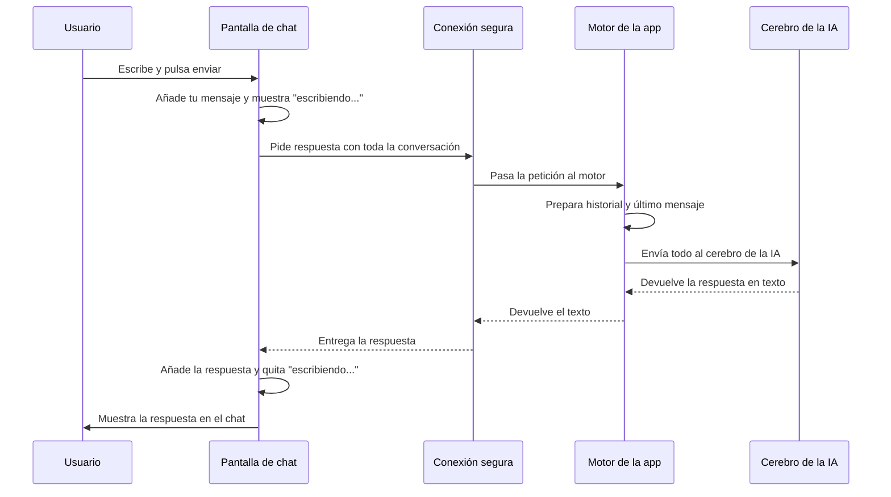
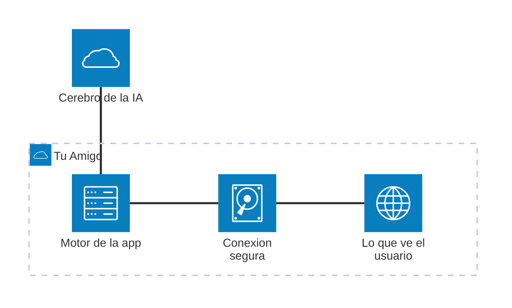
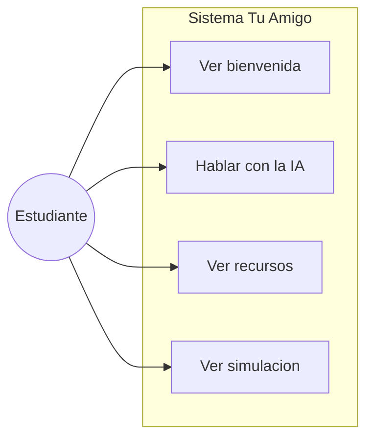
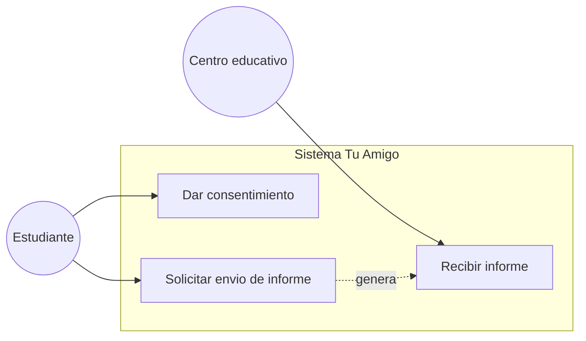

# Tu Amigo — Documentación general

Documento pensado para explicar el proyecto a personas sin conocimientos de informática. Incluye diagramas del funcionamiento, análisis estratégico, competencia y tecnologías utilizadas.

---

## 1. Diagramas de funcionamiento

Los siguientes diagramas describen **cómo está hecha la app por dentro** y **cómo se mueve la información**, usando un lenguaje sencillo.

### 1.1 Cómo está hecha la app por dentro (Arquitectura)

**Esquema general de funcionamiento**

La aplicación tiene tres piezas: lo que ves (pantallas), una conexión segura entre pantallas y el resto del sistema, y el motor que habla con la IA en la nube. Cuando alguien escribe en el chat, la pantalla envía ese mensaje por la conexión segura al motor; el motor prepara la conversación, la manda a Gemini y devuelve la respuesta; la pantalla la muestra.

**Por qué está así ahora:** Hoy no hay base de datos ni servidor propio a propósito: la app puede usarse sin registrar a nadie y sin que los datos salgan del dispositivo más allá de la llamada a la IA. Así se reduce el miedo al primer contacto y no hace falta mantener infraestructura. Las conversaciones viven en memoria; en la simulación se puede descargar una copia en un archivo para uso formativo.

**Por qué se prevé un backend y base de datos:** Para que el apoyo no se quede solo en la charla: hace falta poder guardar conversaciones (para seguimiento y para poder actuar si el menor da consentimiento), clasificar el tipo de riesgo con IA (leve, exclusión, físico/ciberacoso, riesgo grave) y adaptar la respuesta, y poder enviar un informe al centro educativo solo cuando el usuario lo autorice. Por eso en la evolución del proyecto se plantea: (1) una **API orquestada por n8n**, que centralice la lógica (clasificación, generación de respuestas, generación de informes y recordatorios de seguimiento); (2) una **base de datos en Supabase** (PostgreSQL) con tablas para usuarios, conversaciones, informes y centros, y almacén seguro para los PDF de informes; (3) **consentimiento explícito** antes de identificar al menor o enviar nada al centro, para cumplir con protección de datos y no romper la confianza; (4) servidores en la UE (p. ej. Supabase en región EU) para cumplir RGPD. El objetivo es que la app siga siendo un espacio seguro de primer contacto y que, solo si el usuario quiere, ese contacto derive en una actuación real del centro sin sustituir nunca a los profesionales.

**Diagrama interno (tres bloques y flujo):**

---

### 1.2 Por dónde puede ir el usuario (Flujo de navegación)

Desde la pantalla de inicio puedes elegir tres caminos. Desde cualquiera de ellos puedes volver al inicio.

**Flujo de un mensaje en el chat:** cuando escribes y envías un mensaje, este recorre: tu pantalla de chat → la conexión segura → el motor de la app → el cerebro de la IA (Gemini). La respuesta hace el camino de vuelta hasta mostrarse en pantalla.

---

### 1.3 Qué “cosas” maneja la app (Entidad–Relación)

La app no usa base de datos; todo vive en memoria o en un archivo al guardar. Estas son las “cosas” que maneja y cómo se relacionan:

- **Mensaje:** un texto, quién lo envía (usuario o IA) y la hora.
- **Conversación:** la lista de mensajes de un chat.
- **Perfil del estudiante:** nombre, edad, situación, nivel de riesgo y acción sugerida (en la simulación).
- **Métricas emocionales:** tristeza, ansiedad, alivio, esperanza (en la simulación).
- **Sesión de simulación:** el conjunto de perfil, métricas y mensajes que se puede guardar en un archivo.

---

### 1.4 Modelo de datos (Clases)

Este diagrama describe **los datos** que la app maneja: las “cosas” que se guardan en memoria o en un archivo (y que en el futuro podrían vivir en una base de datos). No describe pantallas ni procesos, sino las entidades de información.

---

### 1.5 Qué pasa cuando envías un mensaje en el chat (Secuencia)

Pasos que siguen tu mensaje y la respuesta de la IA, de principio a fin.

---

### 1.6 Vista de arquitectura (componentes y conexiones)

La misma idea del apartado 1.1, en formato de diagrama de arquitectura: qué bloques hay y cómo se conectan. El **Motor** recibe lo que escribes, la **Conexión segura** une las pantallas con el motor, **Lo que ve el usuario** son las pantallas, y el **Cerebro de la IA** es el servicio externo (Gemini) que responde. *Requiere un visor de Mermaid reciente (v11.1+); puedes pegarlo en [mermaid.live](https://mermaid.live) si no se ve.*

---

## 1.7 Casos de uso

Quién usa la app y qué puede hacer con ella. El **actor principal** es el **estudiante** (menor) que abre Tu Amigo para recibir apoyo emocional o consultar recursos. Los casos de uso actuales son los que la aplicación ofrece hoy; los previstos para el futuro incluyen dar consentimiento y enviar informes al centro educativo.

**Casos de uso actuales**

| ID | Caso de uso | Actor | Descripción |
|----|--------------|-------|-------------|
| UC1 | Ver pantalla de bienvenida | Estudiante | Elegir entre "Hablar con alguien", "Ver recursos" o "Simulación IA". |
| UC2 | Hablar con la IA (chat) | Estudiante | Escribir mensajes y recibir respuestas de apoyo emocional de la IA "Tu Amigo" sin registro. |
| UC3 | Ver recursos y ayuda | Estudiante | Consultar teléfonos (112, ANAR), guías (ciberacoso, relajación) y contenido estático. |
| UC4 | Ver simulación IA | Estudiante | Iniciar o detener una simulación donde dos IAs conversan (víctima / ayudante); ver métricas emocionales y ficha del estudiante; guardar sesión en archivo. |

**Casos de uso previstos (futuro)**

| ID | Caso de uso | Actor | Descripción |
|----|--------------|-------|-------------|
| UC5 | Dar consentimiento e identificar | Estudiante | Dar permiso y datos mínimos para poder generar y enviar un informe al centro. |
| UC6 | Solicitar envío de informe al centro | Estudiante | Pedir que se envíe un informe al orientador o responsable del centro. |
| UC7 | Recibir informe | Centro educativo / Orientador | Recibir el informe generado cuando el estudiante ha dado su consentimiento. |

**Diagrama de casos de uso (actual)**

**Diagrama de casos de uso (futuro)**

---

## 2. Análisis DAFO

Análisis de **Fortalezas, Debilidades, Oportunidades y Amenazas** del proyecto Tu Amigo, basado en su estado actual y en su visión de futuro.

### Fortalezas (lo que la app hace bien hoy)

| Punto | Descripción |
|-------|-------------|
| **Idea clara** | Enfocada en apoyo emocional con IA para acoso escolar; el objetivo es fácil de explicar a centros y familias. |
| **Simulación formativa** | La pantalla de simulación permite ver cómo la IA (Tu Amigo) responde a un estudiante en apuros; útil para formar a orientadores o docentes. |
| **Interfaz sencilla** | Pocas pantallas y flujo claro: bienvenida → hablar / recursos / simulación; adecuada para uso en entornos escolares. |
| **Uso anónimo del chat** | No exige registro; el menor puede escribir sin dar datos personales, lo que reduce la barrera del primer contacto. |
| **Respuestas en tiempo real** | Integración directa con un modelo de lenguaje (Gemini) permite una conversación fluida, sin esperas largas. |

### Debilidades (lo que falta o puede mejorar)

| Punto | Descripción |
|-------|-------------|
| **Dependencia de una sola IA** | Todo depende de la API de Gemini y de una clave configurada en el equipo; si falla o cambian condiciones, la app deja de responder. |
| **Sin guardar conversaciones** | No hay base de datos ni backend: el chat no se guarda entre sesiones y no se pueden generar informes para el centro. |
| **Sin clasificación de riesgo** | No está implementada la clasificación automática (leve / exclusión / físico-ciberacoso / riesgo grave) ni el protocolo de aviso a 112 o ANAR. |
| **Solo escritorio** | La app es de escritorio (Electron); muchos menores usan sobre todo móvil, por lo que el alcance es limitado. |
| **Mensaje de error desactualizado** | En caso de error, el chat muestra un texto que habla de “Ollama”, aunque la app usa Gemini; puede confundir a quien dé soporte. |

### Oportunidades (contexto externo favorable)

| Punto | Descripción |
|-------|-------------|
| **Demanda de bienestar en centros** | Normativa y sensibilización sobre convivencia y acoso favorecen la adopción de herramientas de apoyo en colegios e institutos. |
| **Integración con recursos reales** | Posibilidad de conectar con líneas como ANAR o 112 en casos graves, dando un siguiente paso más allá del apoyo emocional. |
| **Extensión a móvil y web** | Llevar Tu Amigo a app móvil o PWA ampliaría el uso donde más están los menores. |
| **Formación de docentes** | La simulación puede usarse en cursos de orientación o convivencia para practicar cómo responder ante un alumno que sufre acoso. |
| **Colaboración con administraciones** | Proyectos piloto con consejerías o ayuntamientos podrían dar visibilidad y financiación. |

### Amenazas (riesgos externos)

| Punto | Descripción |
|-------|-------------|
| **Competencia** | Existen otras líneas de ayuda (ANAR), chatbots de bienestar y herramientas de convivencia; hay que diferenciar bien la propuesta. |
| **Marco legal** | RGPD y normativa de menores (p. ej. menores de 14 años) exigen consentimientos y posible autorización parental; hay que diseñarlo bien. |
| **Coste y condiciones de la IA** | El uso de APIs de IA tiene coste y límites; un uso masivo o un cambio de condiciones puede afectar la viabilidad. |
| **Percepción de “sustituir”** | Algunos pueden ver la app como sustitutiva de profesionales; hay que dejar claro que complementa y deriva, no reemplaza. |

---

## 3. Análisis de la competencia

Quiénes ofrecen algo parecido, qué hacen y cómo se posiciona Tu Amigo.

### Tipos de competidores

1. **Líneas y chats de ayuda a la infancia:** atención por teléfono o chat con profesionales (ej. ANAR, Teléfono de la Esperanza).
2. **Apps y chatbots de bienestar:** aplicaciones o asistentes conversacionales para salud mental o apoyo emocional.
3. **Herramientas de convivencia y acoso:** recursos para centros (detección, informes, formación).
4. **Asistentes conversacionales genéricos:** chatbots o asistentes de IA de uso general, no pensados específicamente para acoso.

### Ejemplos de competencia (España e internacional)

| Competidor / tipo | Qué ofrecen | Fortalezas | Debilidades (para el usuario) |
|-------------------|-------------|------------|-------------------------------|
| **Fundación ANAR** | Línea y chat con profesionales para menores y familias. | Atención humana, experiencia, derivación a recursos reales. | No es anónimo en el sentido de “sin adulto”; puede haber miedo a dar el paso. |
| **Teléfono de la Esperanza** | Apoyo emocional por teléfono 24 h. | Cobertura nacional, voluntarios formados. | No está centrado solo en acoso; menor puede no saber que puede llamar por esto. |
| **Chatbots de bienestar / mental health** | Apps que usan IA para escucha o ejercicios. | Accesibles, sin cita, anonimato. | Muchas son genéricas; no están especializadas en acoso escolar ni en el contexto español. |
| **Herramientas de convivencia en centros** | Módulos en plataformas educativas para reportar o medir clima. | Integradas en el día a día del centro. | Suelen requerir identificación o intervención del centro; no son un “primer contacto” anónimo con apoyo emocional. |

*Nota: la información se basa en conocimiento público de estos servicios; para un análisis formal convendría revisar sus webs y condiciones actuales.*

### Posicionamiento de Tu Amigo

| Aspecto | Tu Amigo |
|--------|----------|
| **Qué es** | App de apoyo emocional con IA, pensada para acoso escolar. |
| **Primer contacto** | Chat anónimo, sin registro; el menor puede escribir antes de hablar con un adulto. |
| **Simulación** | Permite ver una conversación simulada (víctima + ayudante IA); útil para formación, no solo para uso directo del menor. |
| **Recursos** | Incluye pantalla con teléfonos (112, ANAR) y guías; de momento sin envío automático de informes al centro. |
| **Limitación actual** | Solo escritorio; sin persistencia de conversaciones ni informe automático al centro. |

**Hueco que cubre:** primer contacto anónimo con una IA que escucha y apoya en el contexto del acoso escolar, más una herramienta de simulación para que adultos (orientadores, docentes) vean cómo podría actuar “Tu Amigo” antes de usarla con alumnos.

---

## 4. Marco tecnológico

Tecnologías que usa el proyecto, explicadas de forma sencilla y, entre paréntesis, de forma más técnica.

| Tecnología | Para qué sirve (lenguaje sencillo) | Qué es (lenguaje técnico) |
|------------|-------------------------------------|----------------------------|
| **Electron** | Permite que la aplicación funcione como un programa de escritorio en tu ordenador (Windows, Mac, Linux) usando la misma base que una web. | Runtime que combina Chromium y Node.js para construir aplicaciones de escritorio multiplataforma con tecnologías web. En el proyecto: v39. |
| **Node.js** | Es la base sobre la que corre el “motor” de la app en el ordenador (no hace falta instalarlo aparte; viene con Electron). | Entorno de ejecución de JavaScript en el servidor o en procesos de sistema; usado aquí dentro del proceso principal de Electron. |
| **React** | Sirve para construir las pantallas que ves: botones, textos, listas de mensajes, etc., de forma ordenada y reutilizable. | Librería de JavaScript para construir interfaces de usuario basadas en componentes y estado. En el proyecto: React 19. |
| **Vite** | Se encarga de preparar el código para que la app cargue rápido mientras desarrollas y cuando se genera la versión final. | Herramienta de construcción y servidor de desarrollo para frontend; ofrece HMR y empaquetado con Rollup. En el proyecto: Vite 7. |
| **TypeScript** | Añade tipos al código (por ejemplo “este dato es un texto” o “es un número”) para tener menos errores y mejor documentación en el propio código. | Superset de JavaScript con tipado estático; el código se compila a JavaScript. En el proyecto: TypeScript 5.9. |
| **Tailwind CSS** | Permite dar estilo a la app (colores, márgenes, tamaños) escribiendo clases cortas en el código, sin archivos CSS enormes. | Framework de CSS utility-first; estilos mediante clases predefinidas en el HTML/JSX. En el proyecto: v3.4. |
| **Google Generative AI (Gemini)** | Es el “cerebro” que genera las respuestas del chat y de la simulación; la app le envía el texto y recibe la respuesta. | SDK y API de Google para modelos de lenguaje (LLM); el proyecto usa el modelo gemini-2.0-flash para chat y simulación. |
| **dotenv** | Lee una archivo de configuración (.env) donde se guarda la clave de la IA de forma separada del código, para no subirla por error. | Módulo que carga variables de entorno desde un archivo .env; usado para GEMINI_API_KEY. |
| **Lucide React** | Proporciona los iconos de la interfaz (flechas, corazón, mensaje, etc.) como componentes listos para usar. | Librería de iconos en formato React; iconos SVG configurables por tamaño y color. |
| **electron-builder** | Empaqueta la app para generar instaladores (por ejemplo .exe en Windows o .dmg en Mac) y distribuirla. | Herramienta para empaquetar y publicar aplicaciones Electron; genera instaladores y actualizaciones. |
| **ESLint** | Revisa el código en busca de errores frecuentes y de estilo, para mantener un nivel de calidad uniforme. | Linter para JavaScript/TypeScript; en el proyecto se usa con reglas para React y TypeScript. |

### Otras herramientas del proyecto

- **PostCSS / Autoprefixer:** procesan el CSS (por ejemplo para que Tailwind funcione bien en distintos navegadores).
- **Concurrently / wait-on / cross-env:** sirven para lanzar en desarrollo el servidor web y Electron a la vez y en el orden correcto.
- **Supabase, n8n:** aparecen en el plan de proyecto como posibles backend y automatizaciones en el futuro; no están implementados en la versión actual.

---

## Enlaces

- Para una descripción más técnica de la arquitectura y los flujos del código, ver [DIAGRAMA-FUNCIONAMIENTO.md](DIAGRAMA-FUNCIONAMIENTO.md).
- Visión del producto y roadmap: [plan_proyecto.md](../../plan_proyecto.md) (en la raíz del repositorio).
